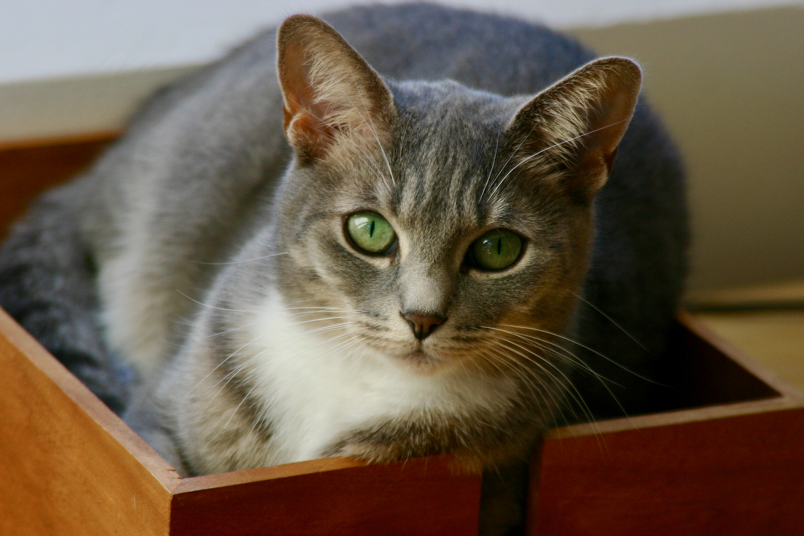

```{r, include = FALSE}
library(ggplot2)
library(dplyr)
library(plotly)

mtcars$cyl <- as.factor(mtcars$cyl)
theme_set(theme_minimal())
```

# Top Level Page -- it gets its own menu tab

This is the top level page; it is not part of the grid.

## Row 1

### Chart 1

```{r plot1}
g <- ggplot(mtcars, aes(disp, hp, color = cyl)) + geom_point()
ggplotly(g)
```

### Chart 2

```{r plot2}
g <- ggplot(mtcars, aes(mpg, hp, color = cyl)) + geom_point()
ggplotly(g)
```

## Row 2 {.tabset .tabset-fade}
 
### Table 1

```{r datatable}
DT::datatable(mtcars)
```

### Photo 1



***

Why analyze cars when you can admire a cat in a box?

Waffles Q. Kitten appears by special arrangement. 

***

